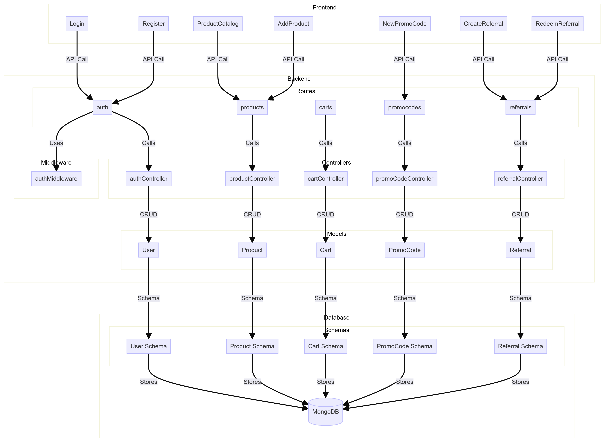
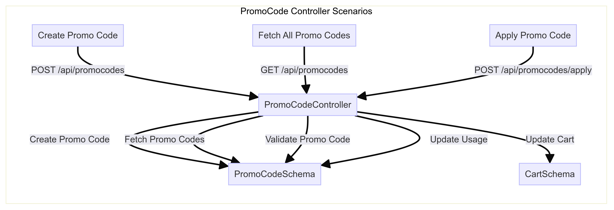

# Shopease

Shopease is a web application that provides an online shopping experience. This repository contains both the backend and frontend parts of the project.

## Table of Contents
- [Prerequisites](#prerequisites)
- [Backend Setup](#backend-setup)
- [Frontend Setup](#frontend-setup)
- [Running the Project](#running-the-project)
- [Project Structure](#project-structure)
- [Contributing](#contributing)
- [License](#license)

## Prerequisites
- Node.js (>= 12.x)
- npm (>= 6.x)
- MongoDB (for backend)

## Backend Setup

1. **Clone the repository:**
   ```bash
   git clone https://github.com/kallurisandeepkumar/shopease.git
   cd shopease/backend
   ```

2. **Install dependencies:**
   ```bash
   npm install
   ```

3. **Set up environment variables:**
   Create a `.env` file in the `backend` directory with the following variables:
   ```env
   PORT=5000
   MONGO_URI=your_mongodb_connection_string
   JWT_SECRET=your_jwt_secret
   ```

4. **Run the backend server:**
   ```bash
   npm start
   ```

   The backend server will start on `http://localhost:5000`.

## Frontend Setup

1. **Navigate to the frontend directory:**
   ```bash
   cd ../my-react-frontend
   ```

2. **Install dependencies:**
   ```bash
   npm install
   ```

3. **Set up environment variables:**
   Create a `.env` file in the `my-react-frontend` directory with the following variable:
   ```env
   REACT_APP_API_URL=http://localhost:5000
   ```

4. **Run the frontend development server:**
   ```bash
   npm start
   ```

   The frontend server will start on `http://localhost:3000`.
   then goto `http://localhost:3000/register`,
   then it will redirect to login.
   

## Running the Project

1. **Start the backend server:**
   ```bash
   cd backend
   npm start
   ```

2. **Start the frontend server:**
   ```bash
   cd ../my-react-frontend
   npm start
   ```

3. **Open your browser and navigate to:**
   ```
   http://localhost:3000
   ```

## Project Structure

```
shopease/
├── backend/
│   ├── controllers/
│   ├── models/
│   ├── routes/
│   ├── app.js
│   ├── config.js
│   └── package.json
└── my-react-frontend/
    ├── public/
    ├── src/
    │   ├── components/
    │   ├── pages/
    │   ├── App.js
    │   ├── index.js
    │   └── package.json
```
## Key Features

### Backend

- **Authentication**: User registration and login via `auth.js` routes.
- **Product Management**: Fetch and add products through `products.js` routes.
- **Promo Codes**: Manage promo codes through `promocodes.js` routes.
- **Referrals**: Create and redeem referrals via `referrals.js` routes.
- **Shopping Cart**: Manage shopping cart via `carts.js` routes.

### Frontend

- **Routing**: Uses React Router to handle different pages.
- **Components**: Organized into reusable components for functionalities like registration, login, product catalog, adding products, promo codes, and referrals.

## Architecture Design





The architecture design includes the following components and data flow:

1. **Client (Frontend)**: React components handle user interactions.
2. **API (Backend)**: Routes and controllers manage the application logic.
3. **Database (MongoDB)**: Schemas define the structure of stored data.

### Diagram Description

1. **Frontend**:
   - **User** interacts with the React components.

2. **Backend**:
   - **API** receives the request and directs it to the appropriate route.
   - **Route** applies the **Middleware** (if any) and calls the **Controller**.
   - **Controller** performs the required operations using the **Model**.
   - **Model** interacts with the **Database** to perform CRUD operations.
   - **Controller** sends the response back through the **API** to the **Frontend**.

### Controller Functions

#### `authController.js`

1. **register**: Registers a new user and returns a JWT token.
2. **login**: Authenticates a user and returns a JWT token.

#### `productController.js`

1. **getProducts**: Fetches all products.
2. **addProduct**: Adds a new product.

#### `cartController.js`

1. **addToCart**: Adds items to the cart or updates existing items.
2. **getCart**: Retrieves the user's cart.

#### `promoCodeController.js`


1. **createPromoCode**: Creates a new promo code.
2. **getPromoCodes**: Fetches all available promo codes.
3. **applyPromoCode**: Applies a promo code to the user's cart.
   - **Scenarios**:
     - Validates if the promo code exists.
     - Checks if the promo code is expired.
     - Verifies if the promo code usage limit is reached.
     - Ensures the user is allowed to use the promo code.
     - Applies the discount to applicable products in the cart.
     - Updates the cart total with the discounted price.
     - Saves the updated cart and promo code usage details.

#### `referralController.js`

1. **createReferral**: Creates a new referral.
2. **getReferralStatus**: Fetches the status of a specific referral.
3. **redeemReferral**: Redeems a referral and generates a promo code for the referred user.


## Assumptions Made:

1. **User Authentication**:
   - Assumed that user authentication is managed using JWT tokens stored in cookies.

2. **Product Management**:
   - Products can be created, viewed, updated, and deleted.

3. **Promo Codes**:
   - Promo codes can be created and applied to the cart.

4. **Referrals**:
   - Users can create referrals and redeem them.

5. **Shopping Cart**:
   - Users can add products to their cart and view the cart's contents.

6. **Environment**:
   - Assumed that the application runs in a local development environment with MongoDB as the database.

7. **Security**:
   - Basic security measures like input validation and JWT authentication are implemented.

8. **Frontend Framework**:
   - Assumed React is used for building the user interface.

9. **Backend Framework**:
   - Assumed Express.js is used for building the backend API.

10. **Data Flow**:
    - Assumed a synchronous flow where the frontend waits for the backend response to update the UI.

## Contributing

Contributions are welcome! Please open an issue or submit a pull request for any improvements or bug fixes.


